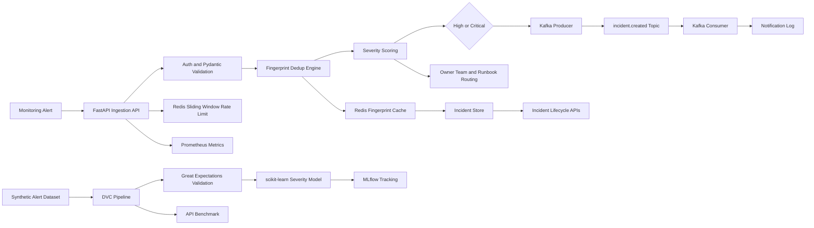

# AlertPilot


**AlertPilot** is an incident triage platform that converts noisy monitoring alerts into deduplicated, prioritized, ownership-routed incidents. It is built for SRE, DevOps, and platform engineering teams that need to reduce alert fatigue, preserve response context, and measure incident operations with production-style telemetry.

Instead of opening a new page for every repeated signal, AlertPilot computes stable incident fingerprints, rate-limits abusive producers, scores severity, routes incidents to the right service owner, publishes high-severity incidents to Kafka, and exposes Prometheus metrics for operational visibility. The offline DVC pipeline validates synthetic alert data, trains a severity classifier, tracks experiments with MLflow, and records benchmark artifacts.

## At a Glance

| Area | Implementation |
| --- | --- |
| Problem solved | Duplicate alerts, slow triage, missing ownership context, and limited incident visibility |
| Target users | SRE teams, DevOps teams, platform engineers, service owners, and engineering managers |
| Runtime API | Authenticated FastAPI service with Pydantic contracts, incident lifecycle endpoints, audit logs, and health/readiness checks |
| Reliability controls | Deterministic deduplication, Redis sliding-window rate limiting, Redis fingerprint cache, severity scoring, and owner/runbook routing |
| Event delivery | Kafka producer publishes `incident.created`; Kafka consumer records high-severity notification activity |
| Data platform | DVC, Great Expectations, scikit-learn, MLflow, and Prefect for reproducible severity-model experimentation |
| Delivery | Docker, Docker Compose, Kubernetes manifests, GitHub Actions CI, and GHCR image publishing |

## Measured Results

Latest local verification from the current codebase:

| Check | Result |
| --- | --- |
| Test suite | 58 passed, 93% line coverage |
| Synthetic dataset | 5,000 alerts generated and validated |
| Severity classifier | 0.697 accuracy, 0.701 weighted F1 |
| API ingestion benchmark | 750 requests at 421.65 requests/sec |
| Latency | 2.371 ms average, 2.176 ms p50, 3.227 ms p95, 6.005 ms p99 |
| Deduplication | 750 repeated alert occurrences grouped into one incident fingerprint |
| Redis fingerprint cache | 99.87% database fingerprint lookup reduction under repeated-alert load |
| Runtime health | `/health` returns `{"status":"ok","service":"AlertPilot"}` |

Benchmark artifacts are generated at:

```text
artifacts/benchmarks/api_benchmark.json
artifacts/benchmarks/api_benchmark.md
```

## Architecture



Runtime flow:

1. A monitoring system submits an alert to `POST /v1/alerts`.
2. FastAPI authenticates the bearer token and validates the payload with Pydantic.
3. Redis enforces a 100-alerts-per-minute sliding-window limit per client.
4. The triage engine computes a deterministic fingerprint from service, environment, and normalized title.
5. Redis is checked for the fingerprint mapping before the database path is used.
6. Matching open incidents increment the occurrence count; new incidents receive severity, owner, tier, and runbook context.
7. High and critical incidents publish `incident.created` events to Kafka for downstream notification handling.
8. Prometheus metrics, structured logs, incident events, and audit records provide operational visibility.

More system-design detail is available in [docs/architecture.md](docs/architecture.md).

## Core Features

| Capability | Implementation |
| --- | --- |
| Alert ingestion | Authenticated `POST /v1/alerts` endpoint with typed Pydantic payloads |
| Rate limiting | Redis-backed sliding-window limiter with 100 alerts/minute per client |
| Deduplication | Deterministic incident fingerprints with Redis cache and database fallback |
| Severity scoring | Rule-based online scoring using service tier, environment, keywords, and metric ratio |
| Event-driven workflow | Kafka producer/consumer path for high and critical incident notifications |
| Service catalog | Owner team, service tier, runbook URL, and escalation window management |
| Incident lifecycle | Open, acknowledged, and resolved states with event timeline |
| Auditability | Login, incident creation, acknowledgement, and resolution audit logs |
| Security | PBKDF2 password hashing, HMAC signed bearer tokens, admin-only catalog writes |
| Observability | Prometheus `/metrics`, structured JSON request logs, health/readiness endpoints |
| MLOps | DVC, MLflow, Great Expectations, Prefect, and scikit-learn training pipeline |
| Delivery | Dockerfile, Compose stack, Kubernetes manifests, GHCR publish workflow, GitHub Actions |

## Tech Stack

| Layer | Tools |
| --- | --- |
| API | FastAPI, Uvicorn, Pydantic |
| Persistence | SQLite repository layer with structured users, services, incidents, events, and audit tables |
| Cache and limits | Redis, `redis.asyncio`, sliding-window counters, TTL fingerprint cache |
| Events | Kafka, aiokafka producer/consumer, typed Pydantic event contracts |
| Auth | PBKDF2 password hashing, HMAC signed bearer tokens |
| Data and ML | pandas, NumPy, scikit-learn |
| MLOps | DVC, MLflow, Great Expectations, Prefect |
| Observability | Prometheus, Grafana, structured JSON logs |
| Deployment | Docker, Docker Compose, Kubernetes, GitHub Actions, GHCR |
| Testing | pytest, pytest-cov, FastAPI TestClient, isolated temporary databases |

## Repository Structure

```text
AlertPilot/
|-- alertpilot/             # API, auth, persistence, triage, cache, events, observability
|-- scripts/                # Data generation, validation, training, benchmarks
|-- tests/                  # Unit and integration tests
|-- static/                 # Lightweight operations console
|-- infra/docker/           # Dockerfile and Compose monitoring stack
|-- k8s/                    # Kubernetes manifests for API, Redis, Kafka, and supporting services
|-- gx/                     # Great Expectations configuration
|-- docs/                   # Architecture and system design notes
|-- dvc.yaml                # Reproducible data/ML/benchmark pipeline
|-- dvc.lock                # Locked pipeline state from local verification
|-- alertpilot_flow.py      # Prefect orchestration flow
|-- requirements.txt        # Runtime and development dependencies
|-- environment.yml         # Conda environment using the same stack
`-- README.md
```

## Quick Start

```bash
python -m venv .venv
source .venv/bin/activate
python -m pip install -U pip
python -m pip install -r requirements.txt
cp .env.example .env
make run
```

Open the API console:

```text
http://127.0.0.1:8000
```

Default local credentials:

```text
email: admin@alertpilot.local
password: changeme
```

Run verification locally:

```bash
python -m pytest --cov=alertpilot --cov-report=term-missing
dvc repro
```

## API Example

Login:

```bash
curl -X POST http://127.0.0.1:8000/v1/auth/login \
  -H "Content-Type: application/json" \
  -d '{"email":"admin@alertpilot.local","password":"changeme"}'
```

Ingest an alert:

```bash
curl -X POST http://127.0.0.1:8000/v1/alerts \
  -H "Authorization: Bearer $TOKEN" \
  -H "Content-Type: application/json" \
  -d '{
    "source": "prometheus",
    "title": "checkout-api p95 latency above SLO",
    "description": "SLO burn alert",
    "service": "checkout-api",
    "environment": "prod",
    "metric_name": "latency_p95",
    "metric_value": 1.7,
    "threshold": 0.75,
    "labels": {"region": "us-east-1"}
  }'
```

## Main Endpoints

| Endpoint | Method | Purpose |
| --- | --- | --- |
| `/health` | GET | Liveness check |
| `/ready` | GET | Database readiness check |
| `/v1/auth/login` | POST | Create signed bearer token |
| `/v1/services` | GET/POST | List or upsert service catalog entries |
| `/v1/alerts` | POST | Ingest alert and create/deduplicate incident |
| `/v1/incidents` | GET | List incidents with status filter |
| `/v1/incidents/{id}` | GET | Incident detail with event timeline |
| `/v1/incidents/{id}/ack` | POST | Acknowledge incident |
| `/v1/incidents/{id}/resolve` | POST | Resolve incident |
| `/v1/summary` | GET | Operational summary counts |
| `/metrics` | GET | Prometheus metrics |

## Data and ML Pipeline

Run the full reproducible pipeline:

```bash
dvc repro
```

Pipeline stages:

1. Generate 5,000 synthetic production alerts.
2. Validate schema and data quality with Great Expectations.
3. Train a scikit-learn severity classifier.
4. Log metrics and artifacts to MLflow.
5. Run an API ingestion benchmark.

Individual commands:

```bash
python scripts/generate_alerts.py
python scripts/validate_alerts.py
python scripts/train_triage_model.py
python scripts/benchmark_api.py
```

## Deployment

Build the API image:

```bash
docker build -t alertpilot:local -f infra/docker/Dockerfile .
```

Run the local operations stack with the API, Redis, Kafka, Prometheus, and Grafana:

```bash
docker compose up --build
```

Services:

| Service | URL |
| --- | --- |
| API | `http://localhost:8000` |
| Prometheus | `http://localhost:9090` |
| Grafana | `http://localhost:3000` |
| Redis | `localhost:6379` |
| Kafka | `localhost:9092` |

The GitHub Actions workflow runs tests with coverage, executes the data pipeline smoke path, builds the Docker image, and publishes `ghcr.io/nitinreddy654/alertpilot:latest` to GitHub Container Registry on every merge to `main`.

## Kubernetes Deployment

Kubernetes manifests live in [k8s/](k8s/). They define the API deployment, ClusterIP service, ConfigMap, Redis, Kafka, and Postgres service definitions.

```bash
kubectl create secret generic alertpilot-secrets \
  --from-literal=token-secret="replace-with-a-long-random-secret" \
  --from-literal=bootstrap-password="replace-with-a-strong-password" \
  --from-literal=postgres-password="replace-with-a-strong-password"
kubectl apply -f k8s/
```

The API deployment uses two replicas, resource requests/limits, `/health` liveness probes, and `/ready` readiness probes.

## Environment Variables

| Variable | Default | Description |
| --- | --- | --- |
| `ALERTPILOT_DB_PATH` | `data/alertpilot.db` | SQLite runtime database path |
| `ALERTPILOT_TOKEN_SECRET` | `dev-only-change-me` | HMAC token signing secret; replace outside local development |
| `ALERTPILOT_TOKEN_TTL_SECONDS` | `3600` | Bearer token lifetime |
| `ALERTPILOT_BOOTSTRAP_EMAIL` | `admin@alertpilot.local` | Default admin account |
| `ALERTPILOT_BOOTSTRAP_PASSWORD` | `changeme` | Default admin password; replace outside local development |
| `ALERTPILOT_ENABLE_REDIS` | `1` | Enables Redis-backed rate limiting and fingerprint caching |
| `ALERTPILOT_REDIS_URL` | `redis://localhost:6379/0` | Redis connection URL |
| `ALERTPILOT_RATE_LIMIT_PER_MINUTE` | `100` | Alert ingestion limit per client |
| `ALERTPILOT_RATE_LIMIT_WINDOW_SECONDS` | `60` | Sliding-window duration in seconds |
| `ALERTPILOT_FINGERPRINT_CACHE_TTL_SECONDS` | `60` | Fingerprint cache TTL in seconds |
| `ALERTPILOT_ENABLE_KAFKA` | `0` | Enables high-severity incident event publishing |
| `ALERTPILOT_KAFKA_BOOTSTRAP_SERVERS` | `localhost:9092` | Kafka broker address |
| `ALERTPILOT_KAFKA_TOPIC` | `incident.created` | Incident event topic |
| `ALERTPILOT_KAFKA_CONSUMER_GROUP` | `alertpilot-notifications` | Consumer group for notification processing |
| `ALERTPILOT_LOG_LEVEL` | `INFO` | Runtime log level |
| `MLFLOW_TRACKING_URI` | `./.mlflow` | MLflow tracking directory |

## Production Design Decisions

| Decision | Rationale | Extension path |
| --- | --- | --- |
| Deterministic fingerprints | Keeps deduplication fast, explainable, and stable during incident response | Add distributed locks for strict once-per-fingerprint creation under high concurrency |
| Redis rate limiting | Protects ingestion from noisy producers while preserving low-latency request handling | Tune limits per source, tenant, service tier, or token identity |
| Redis fingerprint cache | Avoids repeated database fingerprint lookups during alert storms | Use Redis Cluster for multi-instance deployments |
| Rule-based online severity | Keeps incident creation reliable even when ML artifacts are unavailable | Promote the trained model behind a feature flag after shadow evaluation |
| Kafka high-severity events | Decouples incident creation from notification delivery and downstream workflows | Add notification adapters for Slack, PagerDuty, email, or ticketing systems |
| SQLite repository boundary | Keeps local execution deterministic and lightweight | Migrate the database boundary to Postgres for shared multi-replica persistence |
| Prometheus metrics | Provides a standard monitoring surface for platform teams | Add OpenTelemetry traces and SLO dashboards |
| DVC and MLflow | Makes data generation, validation, training, and benchmarking reproducible | Add remote DVC storage and model registry promotion gates |

## Operational Readiness

- API lifecycle checks: `/health` for liveness and `/ready` for database readiness.
- Rate limiting: Redis sliding-window enforcement on `POST /v1/alerts`.
- Deduplication cache: Redis TTL fingerprint cache checked before database lookup.
- Event streaming: Kafka producer/consumer path for high and critical incident events.
- Metrics endpoint: `/metrics` exposes Prometheus-compatible counters and histograms.
- Audit trail: authentication, incident creation, acknowledgement, and resolution are recorded.
- Reproducible pipeline: `dvc repro` regenerates data, validation outputs, model artifacts, metrics, and benchmark reports from source.
- CI/CD: GitHub Actions runs tests with coverage, performs a data pipeline smoke check, builds the container, and publishes to GHCR on `main`.

## Author

Nitin Reddy Bommidi

## License

MIT License. See [LICENSE](LICENSE).
