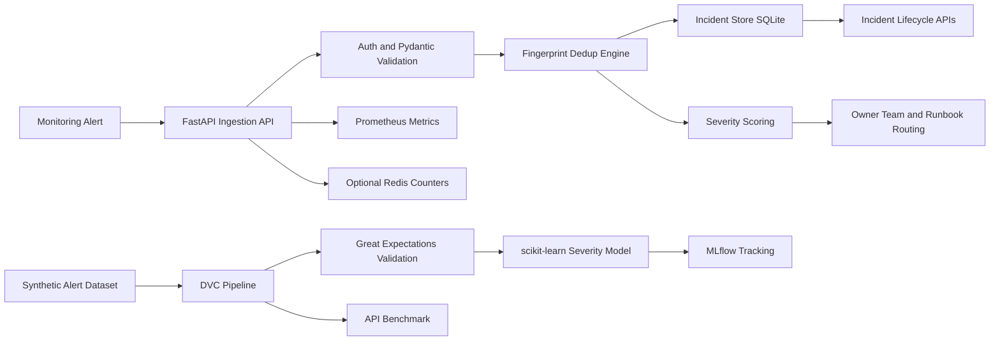

# AlertPilot


**AlertPilot** is a production-style incident triage platform that turns noisy monitoring alerts into deduplicated, prioritized, ownership-routed incidents. It is designed for SRE, DevOps, and platform engineering teams that need to reduce alert fatigue, preserve responder context, and measure incident operations with real metrics.

Instead of treating every alert as a separate page, AlertPilot groups repeated signals into one incident fingerprint, scores severity, attaches service ownership and runbooks, exposes Prometheus metrics, and includes a reproducible DVC/MLflow/Great Expectations pipeline for severity-model experimentation.

## Engineering Overview

| Area | Implementation |
| --- | --- |
| Operational problem | Duplicate production alerts, delayed incident routing, missing runbook context, and limited response visibility |
| Primary users | SRE teams, DevOps teams, platform engineers, and engineering managers |
| Backend services | Authenticated FastAPI API with typed Pydantic contracts, SQLite persistence, audit logs, and incident lifecycle endpoints |
| Reliability model | Deterministic deduplication, severity scoring, ownership routing, health/readiness checks, and Prometheus metrics |
| Data platform | DVC pipeline with Great Expectations validation, scikit-learn severity modeling, and MLflow experiment tracking |
| Delivery model | Docker image, Docker Compose monitoring stack, Redis option, GitHub Actions CI, and Makefile workflows |
| Verified performance | 7 tests passed, 5,000 alerts validated, 600.14 req/s benchmark throughput, and 2.525 ms p95 latency |

## Table of Contents

- [Engineering Overview](#engineering-overview)
- [Problem Statement](#problem-statement)
- [Measured Results](#measured-results)
- [Architecture](#architecture)
- [Core Features](#core-features)
- [Tech Stack](#tech-stack)
- [Quick Start](#quick-start)
- [API Example](#api-example)
- [Data and ML Pipeline](#data-and-ml-pipeline)
- [Deployment](#deployment)
- [Environment Variables](#environment-variables)
- [Production Design Decisions](#production-design-decisions)
- [Implementation Highlights](#implementation-highlights)
- [System Design Rationale](#system-design-rationale)
- [Operational Readiness](#operational-readiness)

## Problem Statement

Production teams often receive hundreds of alerts during the same incident. Without deduplication and ownership routing, responders waste time opening duplicate pages, searching for runbooks, and deciding which service deserves immediate attention.

AlertPilot solves this by providing an incident intake layer that:

- Converts repeated alerts into a single incident with an occurrence count.
- Prioritizes incidents using service tier, environment, alert keywords, and metric threshold ratio.
- Routes each incident to the owning team with runbook context.
- Tracks incident state from open to acknowledged to resolved.
- Exposes operational metrics so engineering leaders can measure alert volume and incident response behavior.

## Measured Results

Latest local verification results:

| Check | Result |
| --- | --- |
| Test suite | 7 passed |
| Synthetic dataset | 5,000 alerts generated and validated |
| Severity classifier | 0.697 accuracy, 0.701 weighted F1 |
| API ingestion benchmark | 750 requests at 600.14 requests/sec |
| Latency | 1.665 ms average, 1.490 ms p50, 2.525 ms p95, 3.812 ms p99 |
| Deduplication | 750 repeated alert occurrences grouped into one incident fingerprint |
| Live server check | `/health` returned `{"status":"ok","service":"AlertPilot"}` |

Benchmark artifacts are generated at:

```text
artifacts/benchmarks/api_benchmark.json
artifacts/benchmarks/api_benchmark.md
```

## Architecture



Runtime path:

1. Monitoring tools submit alerts to `/v1/alerts`.
2. FastAPI validates the request and authenticates the bearer token.
3. The triage engine computes a deterministic fingerprint from service, environment, and normalized title.
4. Matching open incidents are deduplicated by incrementing occurrence counts.
5. New incidents are scored, routed to owner teams, and linked to runbooks.
6. Prometheus metrics and audit events are emitted for operational visibility.

More system-design details are in [docs/architecture.md](docs/architecture.md).

## Core Features

| Capability | Implementation |
| --- | --- |
| Alert ingestion | Authenticated `POST /v1/alerts` endpoint with typed Pydantic payloads |
| Deduplication | Deterministic alert fingerprinting to collapse repeated production signals |
| Severity scoring | Rule-based online scoring using service tier, environment, keywords, and metric ratio |
| Service catalog | Owner team, tier, runbook URL, and escalation window management |
| Incident lifecycle | Open, acknowledged, and resolved states with event timeline |
| Auditability | Login, incident creation, acknowledgement, and resolution audit logs |
| Security | PBKDF2 password hashing, HMAC signed bearer tokens, admin-only catalog writes |
| Observability | Prometheus `/metrics`, structured JSON request logs, health/readiness endpoints |
| MLOps | DVC, MLflow, Great Expectations, Prefect, scikit-learn training pipeline |
| Deployment | Dockerfile, Docker Compose stack, Redis option, Prometheus, Grafana, GitHub Actions |

## Tech Stack

| Layer | Tools |
| --- | --- |
| API | FastAPI, Uvicorn, Pydantic |
| Persistence | SQLite with structured users, services, incidents, events, and audit tables |
| Auth | PBKDF2 password hashing, HMAC signed bearer tokens |
| Data/ML | pandas, NumPy, scikit-learn |
| MLOps | DVC, MLflow, Great Expectations, Prefect |
| Observability | Prometheus, Grafana, structured JSON logs |
| Optional cache/counters | Redis |
| Deployment | Docker, Docker Compose, GitHub Actions |
| Testing | pytest, FastAPI TestClient, isolated temporary databases |

## Repository Structure

```text
AlertPilot/
|-- alertpilot/             # API, auth, persistence, triage engine, observability
|-- scripts/                # Data generation, validation, training, benchmarks
|-- tests/                  # Unit, API, security, and project contract tests
|-- static/                 # Lightweight operations console
|-- infra/docker/           # Dockerfile and monitoring compose stack
|-- gx/                     # Great Expectations config
|-- docs/                   # Architecture and system design notes
|-- dvc.yaml                # Reproducible data/ML/benchmark pipeline
|-- dvc.lock                # Locked pipeline state from local verification
|-- alertpilot_flow.py      # Prefect orchestration flow
|-- requirements.txt        # Runtime and development dependencies
|-- environment.yml         # Conda environment using the same stack
`-- README.md
```

## Quick Start

```bash
python -m venv .venv
source .venv/bin/activate
python -m pip install -U pip
python -m pip install -r requirements.txt
cp .env.example .env
make run
```

Open:

```text
http://127.0.0.1:8000
```

Default development credentials:

```text
email: admin@alertpilot.local
password: changeme
```

Run verification locally:

```bash
make test
make pipeline
```

## API Example

Login:

```bash
curl -X POST http://127.0.0.1:8000/v1/auth/login \
  -H "Content-Type: application/json" \
  -d '{"email":"admin@alertpilot.local","password":"changeme"}'
```

Ingest an alert:

```bash
curl -X POST http://127.0.0.1:8000/v1/alerts \
  -H "Authorization: Bearer $TOKEN" \
  -H "Content-Type: application/json" \
  -d '{
    "source": "prometheus",
    "title": "checkout-api p95 latency above SLO",
    "description": "SLO burn alert",
    "service": "checkout-api",
    "environment": "prod",
    "metric_name": "latency_p95",
    "metric_value": 1.7,
    "threshold": 0.75,
    "labels": {"region": "us-east-1"}
  }'
```

## Main Endpoints

| Endpoint | Method | Purpose |
| --- | --- | --- |
| `/health` | GET | Liveness check |
| `/ready` | GET | Database readiness check |
| `/v1/auth/login` | POST | Create signed bearer token |
| `/v1/services` | GET/POST | List or upsert service catalog entries |
| `/v1/alerts` | POST | Ingest alert and create/deduplicate incident |
| `/v1/incidents` | GET | List incidents with status filter |
| `/v1/incidents/{id}` | GET | Incident detail with event timeline |
| `/v1/incidents/{id}/ack` | POST | Acknowledge incident |
| `/v1/incidents/{id}/resolve` | POST | Resolve incident |
| `/v1/summary` | GET | Operational summary counts |
| `/metrics` | GET | Prometheus metrics |

## Data and ML Pipeline

Run the full reproducible pipeline:

```bash
make pipeline
```

No pre-existing model or dataset artifacts are required. DVC regenerates the synthetic dataset, validation output, model artifact, metrics, and benchmark results from source.

Pipeline stages:

1. Generate 5,000 synthetic production alerts.
2. Validate schema and data quality with Great Expectations.
3. Train a scikit-learn severity classifier.
4. Log metrics and artifacts to MLflow.
5. Run an API ingestion benchmark.

Individual commands:

```bash
python scripts/generate_alerts.py
python scripts/validate_alerts.py
python scripts/train_triage_model.py
python scripts/benchmark_api.py
```

## Deployment

Build the API container:

```bash
make docker
```

Run the app with Redis, Prometheus, and Grafana:

```bash
docker compose -f infra/docker/monitoring/docker-compose.yml up --build
```

Services:

| Service | URL |
| --- | --- |
| API | `http://localhost:8000` |
| Prometheus | `http://localhost:9090` |
| Grafana | `http://localhost:3000` |

## Environment Variables

| Variable | Default | Description |
| --- | --- | --- |
| `ALERTPILOT_DB_PATH` | `data/alertpilot.db` | SQLite runtime database path |
| `ALERTPILOT_TOKEN_SECRET` | `dev-only-change-me` | HMAC token signing secret. Change for non-local use. |
| `ALERTPILOT_TOKEN_TTL_SECONDS` | `3600` | Bearer token lifetime |
| `ALERTPILOT_BOOTSTRAP_EMAIL` | `admin@alertpilot.local` | Default admin account |
| `ALERTPILOT_BOOTSTRAP_PASSWORD` | `changeme` | Default admin password. Change for non-local use. |
| `ALERTPILOT_ENABLE_REDIS` | `0` | Enables optional Redis integration |
| `ALERTPILOT_REDIS_URL` | `redis://localhost:6379/0` | Redis connection URL |
| `ALERTPILOT_LOG_LEVEL` | `INFO` | Runtime log level |
| `MLFLOW_TRACKING_URI` | `./.mlflow` | MLflow tracking directory |

## Production Design Decisions

| Decision | Rationale | Production extension |
| --- | --- | --- |
| Deterministic fingerprints | Fast, explainable deduplication for incident responders | Add Redis-backed distributed locks for high-concurrency ingestion |
| Rule-based online severity | Keeps incident creation reliable even if ML artifacts are unavailable | Promote trained model behind a feature flag after shadow evaluation |
| SQLite persistence | Portable for local development, deterministic tests, and lightweight evaluation | Migrate `Database` interface to Postgres for multi-instance deployments |
| PBKDF2 and signed tokens | Avoids plaintext credentials and hard-coded API tokens | Use managed identity provider and external secrets manager |
| Prometheus metrics | Standard monitoring surface for platform teams | Add OpenTelemetry traces and SLO dashboards |
| DVC and MLflow | Reproducible data, model, and benchmark workflow | Add remote DVC storage and model registry promotion gates |

## Implementation Highlights

| Area | Details |
| --- | --- |
| Incident ingestion | Accepts authenticated alert payloads, validates them with Pydantic, and persists normalized incident records. |
| Deduplication engine | Generates deterministic fingerprints from alert context so repeated signals update the same incident instead of creating noisy duplicates. |
| Severity routing | Combines environment, service tier, alert keywords, and threshold ratio to prioritize incidents and attach owner-team/runbook context. |
| Security controls | Uses PBKDF2 password hashing, signed bearer tokens, role-aware service catalog writes, and environment-based configuration. |
| Observability | Exposes Prometheus metrics, structured JSON request logs, health checks, readiness checks, and auditable incident events. |
| Data workflow | Uses DVC to reproduce synthetic data generation, Great Expectations validation, scikit-learn training, MLflow tracking, and API benchmarking. |
| Delivery workflow | Includes Docker, Docker Compose, Redis integration, Prometheus/Grafana monitoring, CI, and Makefile commands for common operations. |

## System Design Rationale

AlertPilot keeps the online incident path deterministic so alert ingestion remains fast, explainable, and available even when offline ML artifacts are not present. The severity classifier is trained and tracked through the reproducible data pipeline, but production incident creation still has a rule-based scoring path that can be audited and reasoned about by responders.

The persistence layer is intentionally compact and portable for local execution, automated tests, and code review. The database access boundary is isolated so the same schema can be migrated to Postgres for multi-instance deployments without changing public API contracts.

The observability model follows common platform engineering patterns: request latency and request count metrics are exported through Prometheus, logs are structured for downstream ingestion, and health/readiness endpoints separate process liveness from dependency readiness.

## Operational Readiness

- API lifecycle checks: `/health` for liveness and `/ready` for database readiness.
- Metrics endpoint: `/metrics` exposes Prometheus-compatible counters and histograms.
- Incident audit trail: authentication, incident creation, acknowledgement, and resolution are recorded.
- Reproducible pipeline: `dvc repro` regenerates data, validation outputs, model artifacts, metrics, and benchmark reports from source.
- Deployment path: Dockerfile and Compose stack run the API with Redis, Prometheus, and Grafana.
- CI coverage: GitHub Actions installs dependencies, runs tests, executes the data pipeline smoke path, and builds the container image.
- Scaling path: Redis-backed distributed deduplication, Postgres persistence, OpenTelemetry traces, managed secrets, and model promotion gates can be added without changing the external API shape.

## Author

Nitin Reddy Bommidi

## License

MIT License. See [LICENSE](LICENSE).
